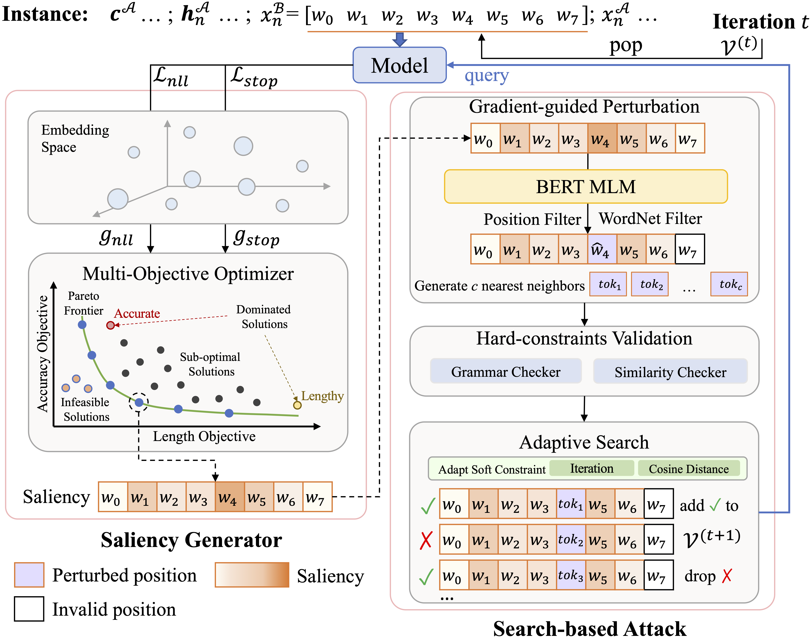
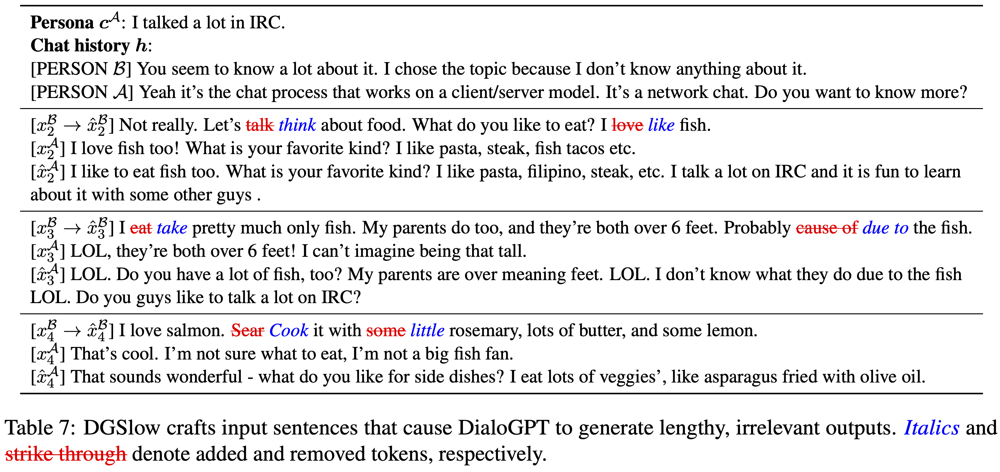

# DGSlow
Codebase for the ACL 2023 paper: "White-Box Multi-Objective Adversarial Attack on Dialogue Generation" ([PDF](https://aclanthology.org/2023.acl-long.100.pdf)).

<p align="center">
  
</p>

## Quickstart

### Setup Environment
- python 3.10.8
- pytorch 1.13.0+
- Install dependencies
```
pip install -r requirements.txt
```

### Train and evaluate a model on a specific task(s)

- BART in Blended Skill Talk:
```
python train_seq2seq.py --model_name_or_path facebook/bart-base --dataset blended_skill_talk --output_dir results/bart-base
```
- DialoGPT in Empathetic Dialogues:
```
python train_clm.py --model_name_or_path microsoft/DialoGPT-small --dataset empathetic_dialogues --output_dir results/dialogpt-small
```

### Attack a pre-trained model
- Structure attack on DialoGPT-small in Blended Skill Talk:
```
python attack.py --attack_strategy structure --model_name_or_path results/bart-base --dataset blended_skill_talk
```
- DF attack on bart-base in Empathetic Dialogues:
```
python attack.py --attack_strategy FD --model_name_or_path results/bart-base --dataset empathetic_dialogues
```
<p align="center">
  
</p>

### Transfer attack
- Transfer attack from DialoGPT-small to bart-base in Blended Skill Talk:
```
python eval.py --file ${FILE} --orig_model bart-base --victim_model dialogpt-small --dataset BST --out_dir logging
```

## Citation
Please cite the paper in your publications if you find this repo useful:
```bibtex
@inproceedings{li2023white,
  title={White-Box Multi-Objective Adversarial Attack on Dialogue Generation},
  author={Li, Yufei and Li, Zexin and Gao, Yingfan and Liu, Cong},
  booktitle={Annual Meeting of the Association for Computational Linguistics (ACL)},
  year={2023}
}
```

## Acknowledgement
Our implementation is based on [OpenAttack](https://github.com/thunlp/OpenAttack). We would like to thank the authors for their open source code.
